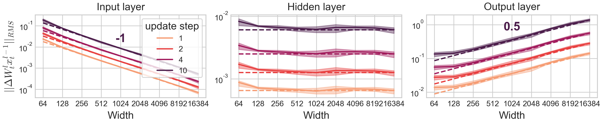

# On the Surprising Effectiveness of Large Learning Rates under Standard Width Scaling

<p align="center">
  
</p>


This repository provides code to reproduce all experiments in the NeurIPS 2025 spotlight paper [&#39;On the Surprising Effectiveness of Large Learning Rates under Standard Width Scaling&#39;](https://arxiv.org/pdf/2505.22491).

## Refined coordinate check

As a useful diagnostic tool, we implement fine-grained tracking of neural network internals that are helpful for understanding how width scaling affects the updates of each trainable weight matrix. In the paper, we find that the decomposition $W_t x_t - W_0 x_0 = \Delta W_t x_t + W_0 \Delta x_t$, where $W_t$ denotes the trainable weight matrix and $x_t$ its input at time $t$, into effective updates $\Delta W_t x_t$ and propagating updates $W_0\Delta x_t$ (propagating from previous layers) of each trainable weight matrix is crucial for understanding internal width dependence, because both terms can scale fundamentally differently, and in some cases one dominates at moderate scale, while the other strictly dominates at large scale.

Empirically, we observe robust scaling laws predictable by Tensor Program arguments of effective updates $\Delta W_t x_t$ and propagating updates $W_0\Delta x_t$ of each trainable weight matrix as a function of width that allow extrapolating trends and predicting phase transitions in the dynamics at large model scale.

For Transformers, [our training and tracking code](https://github.com/tml-tuebingen/torch-module-monitor) is easy to adapt and reuse.

For MLPs, see the corresponding section below.

## GPT Experiments

The transformer experiments were performed using a modified version of LitGPT, which implements training with SP and muP, and monitors modules during training. 

You can find the fork [here](https://github.com/sbordt/litgpt/), and an easy-to-use repo for fine-grained layerwise signal-prop monitoring [here](https://github.com/tml-tuebingen/torch-module-monitor). The entry point for our experiments is the script ```pretrain-experiments/pretrain-experiment.py```.

The shell scripts with the parameters for the different experiments are in this repository under ```transformer-scripts```.

## Closed-form update dynamics of 2-layer linear nets in SP, NTP and $\mu$P

This code is provided in the subfolder `uv_dynamics_closedform/`.

Run closed-form 2-layer linear net update equations and plot maximal stable learning rate scaling (Figure C.2): `uv_model_maxstablelr_sp.py`

Run closed-form 2-layer linear net update equations and plot differences between finite and infinite-width limit (Figure C.3 and C.4): `uv_model_convergence.py`

## MLPs

This code is provided in the subfolder `mlp_experiments/`.

The code is designed for a 2-stage process:

1) Train MLPs, compute many internal stats over the course of training and save them. (you may want to do this on a compute node)
2) Plot the saved statistics. (the evaluation can be done on the local machine)

### Installation

We use a different virtual environment for the MLP experiments, which is quickly set up.

**Step 1:** Create a conda environment:

```
conda create -n sp-largelr python=3.11 pip
conda activate sp-largelr
```

**Step 2:** Install Python package dependencies:

```
pip install -r pip_requirements.txt
```

### Training and saving tracked statistics

#### Learning rate sweeps

It is advised to first sweep over learning rates and widths to determine the optimal learning rate at base width 256 as well as the optimal learning rate exponent. Detailed tracking can then be run only on the optimal LR_256 * (WIDTH/256)**lrexp at each WIDTH.

An example training run of 8-layer MLPs of varying width on CIFAR10 without extensive statistic tracking may look like:

```
srun python3 main_mlp_allwidths.py --seed 42 --dataset cifar10 --nhiddenlayers 7 --lr 0.032 --param sp --optim SGD --lrexp -0.5 --nepochs 1 --nomultipliers --width_choice few
srun python3 main_mlp_allwidths.py --seed 142 --dataset cifar10_mse --nhiddenlayers 7 --lr 0.1 --param sp --optim SGD --nepochs 1 -nomultipliers --lrexp -1.0 --width_choice few

```

#### Extended evaluation

Detailed logging of loss, activation, weight (update) and gradient norms, alignment, sparsity, Hessian statistics, and difference to a wide model are implemented by hand and can optionally be computed and saved (to the subfolder `stats/`.) every e.g. 20 batches with `--evaliter 20 --extendedevaliter 20`, and after training with `--finaleval`. Much time can be saved when not computing Hessian statistics with `--only_track_norms`. `--del_last_step` computes update statistics with respect to the previous step ($\delta$) instead of the initial model ($\Delta$). Thus width sweeps with extensive evaluations at near-optimal learning rate can, for example, be computed by running:

```
# C10, SGD, sp, constant LR scaling
srun python3 main_mlp_allwidths.py --seed 42 --nhiddenlayers 2 --lr 0.032 --param sp --optim SGD --nepochs 1 --nomultipliers --only_track_norms --evaliter 20 --extendedevaliter 20 --del_last_step

# C10, ADAM, sp, LR=lr*n^-1 (optimal LR at 256 after 1 epoch)
srun python3 main_mlp_allwidths.py --seed 142 --nhiddenlayers 2 --lr 0.00032 --param sp --optim ADAM --nepochs 1 --nomultipliers --only_track_norms --evaliter 20 --extendedevaliter 20 --lrexp -1.0 --width_choice fine
```

Statistics are saved in a dict with keys (WIDTH,LR,RHO) for easy composition of several widths and learning rates (and perturbation radii RHO>0 for SAM). Each entry consists of another dict with the keys of the tracked statistics as specified in trainer_mlp.py lines 244-299. E.g. for the training and test accuracy use 'Loss/train' and 'Loss/val'. This dict contains a list[iseed][iter]. Each entry is of the form (time_step, value, epoch_bool), where epoch_bool specifies whether this value was computed at the end of an epoch, or after a certain amount of steps. Functions to deal with this structure are provided in the plotting files.

For comparing to a wide model of  width 16384 and computing the difference on train and test set 'l2diff2wide_train' and 'l2diff2wide_test', train and save the wide model with `--width_choice wide --savefinalmodel` (saves a checkpoint to the subfolder `checkpoint/`) before running the other widths.

#### Further optional arguments

`main_mlp_allwidths.py` provides many optional arguments for training MLPs (see `main_mlp_allwidths.py` for all optional arguments):

```
--nhiddenlayers 1 trains a 2-layer MLP

--linear trains a linear MLP (activation is identity)

--lr sets the learning rate

--lrexp scales the learning rate from base width 256 as LR_256 * (WIDTH/256)**lrexp.

--optim optimizer. Implemented are: SGD, ADAM, SAM-SGD. LL-SGD or LL-ADAM only train the last layer (random feature model)

--param specifies the parameterization, that is the layerwise initialization variances and learning rates: sp (PyTorch standard, He initialization and global learning rate for all layers), mup, ntp, mup_spllit (mup but the last layer is initialized as in SP, this is called SP-full-align in the paper), mup_spllit_largelr (same as mup_spllit but the last-layer learning rate is increased by a factor sqrt(width) to match the propagating update scaling).

--dataset specifies the dataset and loss used. Implemented are: cifar10 (CIFAR-10 with CE loss), cifar10_mse (CIFAR-10 with MSE loss), cifar10_mse_softmax (CIFAR-10 with MSE loss and softmax applied to logits), teacher (multi-index data from chizat and kunin papers but class-balanced; uses MSE loss), teacher_ce (same data, but target function transformed into binary classification task using torch.nn.CrossEntropyLoss), teacher_softmax (uses MSE loss with softmax applied to logits), mnist (MNIST with CE loss), mnist_mse (MNIST with MSE loss), mnist_mse_softmax (MNIST with MSE loss and softmax applied to logits)

--width_choice train networks of increasing width sequentially: standard (256, 1024, 4096, 16384), few (256, 1024, 4096, 16384), fine (256, 512, 1024, 2048, 4096, 8192, 16384)

--nomultipliers if not using this, it is expected to specify constant premultipliers for the input and output layer that should be tuned. Additionally --yangmult takes the tuned multipliers for MLPs on CIFAR-10 from the mup package.

--llzeroinit initializes the last layer to zero (as sometimes done for improved transfer of mup).
```

For mup on CIFAR-10, decent hyperparameters are --lr 0.316227766 --llzeroinit --initvarnorm --param mup --optim SGD --yangmult

### Plotting precomputed statistics

The saved statistics precomputed as explained above can be plotted with the following scripts:

Figure 1: Optimal learning rate as a function of width `plot_fig1_optlrvstheory.py`

Figure 2: Update alignment in GPT layers over the course of time (loaded from wandb) `plot_gpt_rcc_wandb.py`

Figure 4: Effective update norm as a function of width `plot_coordcheck.py` (after running `coord_checks.py`).

Figure 5 (left): Width-scaled learning rate versus accuracy `plot_lr_vs_acc.py`

Figure 5 (right): Optimal learning rate exponents and minimal unstable learning rate exponents as a function of width `plot_lrexpon_mlp.py`. 

Figure 6 (left): Width-scaled learning rate versus loss loading GPT stats from wandb `plot_gpt_lr_vs_loss_wandb.py`

Figure 6 (right): Optimal learning rate exponents and minimal unstable learning rate exponents as a function of width `plot_lrexpon_gpt.py` after `plot_gpt_lr_vs_loss_wandb.py`

Figure 7: Optimal accuracy as a function of width across losses and parameterizations `plot_optacc_allparamslosses.py`

Refined coordinate check for GPT (Figure C.1): Effective update and propagating update norm as a function of width, with stats loaded from wandb  `plot_gpt_rcc_wandb.py`

### Refined Coordinate Checks for MLPs

For refined coordinate checks, 1) either run `coord_checks.py` for calculating and saving refined coordinate checks for 10 update steps (which can be done locally), specifying the parameterization and iterating over several optimizers and learning rate exponents in the script, then plot the saved statistics using `plot_coordcheck.py`, or 2) run training with statistic tracking for longer (should likely be done on a compute node). Propagating updates $W_0\Delta x$ of all layers are saved in the key 'W_delta_x_norms', and effective updates in 'delta_W_x_norms'. Then plot the saved statistics using `plot_coordcheck_extended.py`.

## Citation

If you use this software, or any ideas from our code or paper, please cite the following publication:

```bib
@article{haas2025splargelr,
  title={On the Surprising Effectiveness of Large Learning Rates under Standard Width Scaling},
  author={Haas, Moritz and Bordt, Sebastian and von Luxburg, Ulrike and Vankadara, Leena Chennuru},
  journal={arXiv:2505.22491},
  year={2025}
}
```


